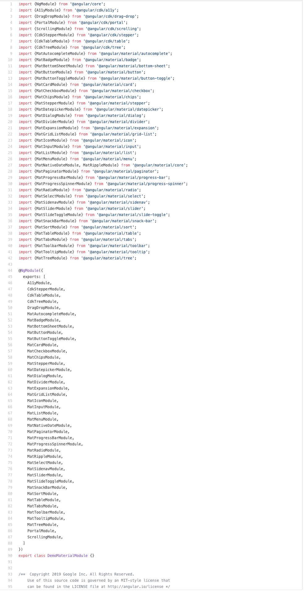

# All Angular Material components import in Angular 

## Installation

[Angular Material Official site](https://material.angular.io/guide/getting-started#install-angular-material)

Use the Angular CLI's to install Angular Material project by running the following command:


```bash
ng add @angular/material 
```


